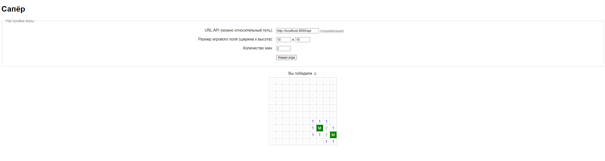

# Minesweeper API


Репозиторий содержит реализацию серверной части игры Сапёр на Java с использованием Spring Boot. Игра реализована как REST API, предоставляющее функциональность для создания игры, выполнения ходов и получения информации о текущем состоянии игры. API позволяет создать игру с заданными размерами поля и количеством мин, а затем делать ходы, открывая ячейки на поле.

## Спецификация API

### Настройка игры

Каждая игра начинается с указания размера поля (`width` и `height`), а также количества мин (`mines_count`) на нём. Хотя в оригинальном задании не предусмотрены ограничения, для тестовой реализации мы ограничим входные параметры: ширина и высота поля не должны превышать 30, а количество мин не должно превышать `width * height - 1` (должна оставаться хотя бы одна свободная ячейка).

### Выполнение ходов

После создания игры (идентифицируется с помощью `game_id`, полученного в ответе) игрок может делать ходы, указывая координаты ячейки, которую он хочет открыть, а именно `row` (номер ряда, начиная с нуля) и `col` (номер колонки, начиная с нуля).

### Ответы API

Оба метода возвращают данные о самой игре: уникальный идентификатор игры `game_id`, размеры поля и количество мин, указанные при создании игры, а также данные о поле (`field`) в виде двумерного массива символов (`height` строк, в каждой по `width` элементов). Пустые строки `" "` (пробелы) обозначают неоткрытые ячейки на поле, цифры от `"0"` до `"8"` обозначают открытые ячейки, где цифры указывают, сколько мин расположено в непосредственной близости от текущей ячейки. Также возвращается параметр `completed`, указывающий, завершена ли текущая игра.

### Условия окончания игры

- Игра заканчивается, если игрок нажал на ячейку с миной (ячейки с минами при этом отмечаются символом `"X"` — заглавная латинская "икс").
- Игра также заканчивается, если игрок открыл все ячейки, не занятые минами (в этом случае мины отмечаются символом `"M"` — заглавная латинская "эм").
- При завершении игры все остальные ячейки должны показать количество мин рядом с ними.

### Дополнительные правила

- Если в процессе игры игрок открывает ячейку, рядом с которой нет ни одной мины (ячейка со значением `"0"`), автоматически должны открыться все смежные ячейки, рядом с которыми также нет ни одной мины, а также все смежные с ними "числовые" ячейки, показывающие количество мин рядом.
- После завершения игры новые ходы делать нельзя, а также повторно проверять уже проверенную ячейку. Эти и другие ошибочные ситуации должны возвращать ошибку с кодом `400 Bad Request` и текстовым описанием ошибки в поле `error`.

## Скриншоты
### Примеры игры

### Победа в игре


### Поражение в игре




## Установка и запуск проекта

### Технологии

- **Java 17**: Язык программирования для реализации проекта.
- **Spring Boot**: Фреймворк для разработки веб-приложений на Java.
- **Gradle**: Инструмент для автоматизации сборки проекта.
- **Lombok**: Библиотека для автоматического создания геттеров, сеттеров и других методов.
- **Jackson**: Библиотека для работы с JSON, используемая для сериализации/десериализации данных.
- **SLF4J + Logback**: Логгирование в приложении.

### Установка

1. **Клонирование репозитория:**

   ```bash
   git clone https://github.com/SautovAndrey/Minesweeper-API.git
   ```

2. **Переход в директорию проекта:**

   ```bash
   cd Minesweeper-API
   ```

3. **Установка зависимостей:**

   Если у вас ещё не настроен Gradle, его нужно установить. Затем выполните команду:

   ```bash
   ./gradlew build
   ```

### Запуск приложения:

Для запуска приложения выполните:

```bash
./gradlew bootRun
```

Приложение будет доступно по адресу [http://localhost:8080/api](http://localhost:8080/api)


